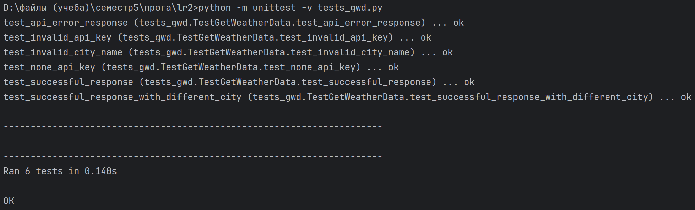

# Кочеткова Мария Павловна ИВТ-2.2. 
## Лабораторная работа 2. Использование API openweathermap.org.  

Написана реализация функции get_weather_data(place, api_key=None), в которой необходимо получить данные о погоде с 
сайта https://openweathermap.org/.

(Файл mykey.py, содержащий API_key, добавлен в .gitignore)

Функция возвращает объект в формате JSON, включающий:

* информацию о названии города (в контексте openweathermap),
* код страны (2 символа),
* широту и долготу, на которой он находится,
* его временной зоне,
* а также о значении температуры (как она ощущается).

Тестирование [программы](https://github.com/Maria-Kochetkova/LR_Prog_5_sem/blob/main/lr2/getweatherdata.py) с городами:

  

Реализованы тесты корректно выводимых данных (Москва, Нью-Йорк)  
а также тесты вывода ошибки при:  
    
1. вводе пустой строки в название города
2. вводе несуществующего города
3. вводе пустого ключа
4. вводе неправильного ключа

Результаты тестов:

