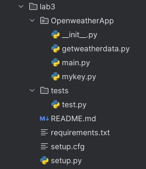
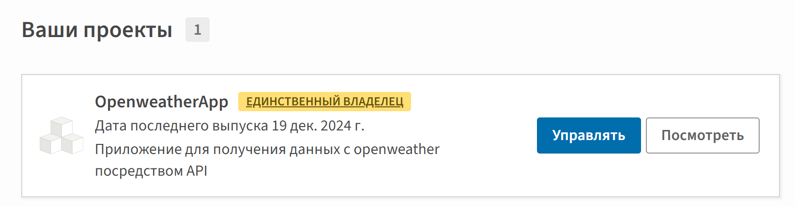

# Кочеткова Мария Павловна ИВТ-2.2. 
## Лабораторная работа 3. Создание своего пакета. Публикация на pypi.
___

Проект для работы с open weather посредством API опубликован в TestPyPI, предворительно преобразован к необходимому виду.

Опубликованный проект: [OpenweatherApp](https://test.pypi.org/project/OpenweatherApp/)

1. Структоризация элементов и добавление недостоющих 



2. Создание аккаунта на TestPyPI
3. Установка библиотек для публикации
```Python 
    pip install setuptools
```
```Python 
    pip install twine
```
4. Развертывание пакета запуском setup.py из родительского каталога
```Python 
    python setup.py sdist
```
(теперь в родительской папке будут созданы две новых директории (egg-info и dist))

5. Развертывание пакета на TestPyPI с помощью twine
```Python 
    twine upload --repository testpypi dist/*
```
6. Пакет размещён на сервере



