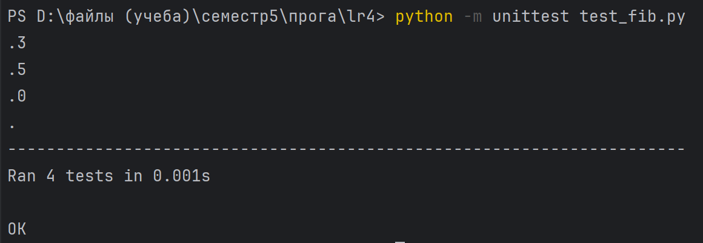

# Кочеткова Мария Павловна ИВТ-2.2. 
## Лабораторная работа 4. Создание генератора с элементами ряда Фибоначчи  
___

Часть 1. Создание сопрограммы на основе кода, позволяющей по данному n сгенерировать список элементов из ряда Фибоначчи.

[Код программы](https://github.com/Maria-Kochetkova/LR_Prog_5_sem/blob/main/lr4/fibonacci.py)

Также были написаны тесты для этой программы.

[Тесты](https://github.com/Maria-Kochetkova/LR_Prog_5_sem/blob/main/lr4/test_fib.py)

Результат программы:  

Результат тестов:  

Часть 2. Создание программы, возвращающей список чисел Фибоначчи с помощью итератора.

[Код программы](https://github.com/Maria-Kochetkova/LR_Prog_5_sem/blob/main/lr4/fib_list.py)

Также были написаны тесты для этой программы.

[Тесты](https://github.com/Maria-Kochetkova/LR_Prog_5_sem/blob/main/lr4/test_fib_list.py)

Результат программы:  

Результат тестов:  

