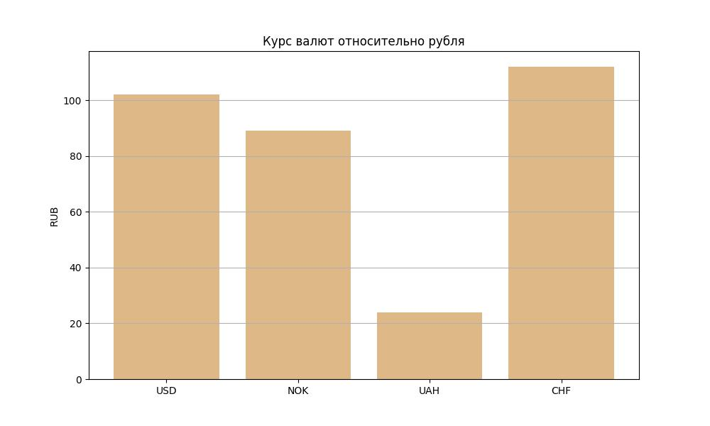
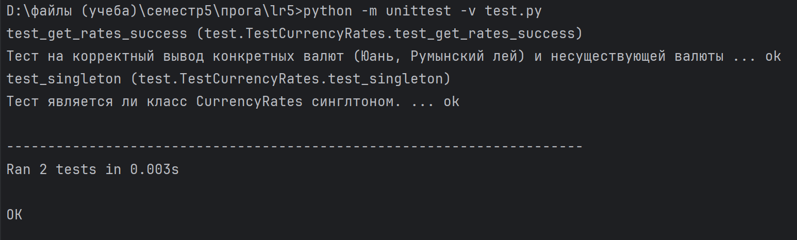

# Кочеткова Мария Павловна ИВТ-2.2. 
## Лабораторная работа 5. Работа с валютами. Шаблон «одиночка» 
___

Получить значения курсов валют с сайта ЦБ РФ в объектно-ориентированном стиле. Реализовать шаблон проектирования 
"одиночка", чтобы нельзя было создать больше чем один объект данного класса. Одиночка должен быть реализован с 
помощью метаклассов.

[Код программы](https://github.com/Maria-Kochetkova/LR_Prog_5_sem/blob/main/lr5/main.py)  
[Тесты к программе](https://github.com/Maria-Kochetkova/LR_Prog_5_sem/blob/main/lr5/test.py)

Результат работы:

Пример запуска:
```Python
    currency_rates = CurrencyRates()
    result = currency_rates.get_rates(["R01235", "R01535", "R01775", "R01720"]) 
```  
Возвращийся список валют:

```Python
     [{'USD': ('Доллар США', ('102', '2911'))},
      {'NOK': ('Норвежских крон', ('89', '6378'), 10)},
      {'UAH': ('Гривен', ('24', '2189'), 10)},
      {'CHF': ('Швейцарский франк', ('112', '2105'))}]
```    
Визуализация полученных данных в виде графика и сохранение в файле 'currencies.jpg':


Тесты успешно выполняются:


