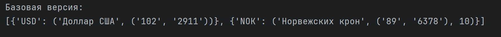

# Кочеткова Мария Павловна ИВТ-2.2. 
## Лабораторная работа 6. Использование шаблона «Декоратор»

Результат работы [программы](https://github.com/Maria-Kochetkova/LR_Prog_5_sem/blob/main/lr6/main.py): 

Выведение курсов валют в виде списка:

в JSON-формате:  

в CSV-формате:  

