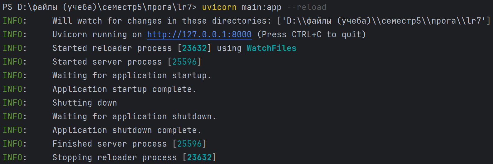
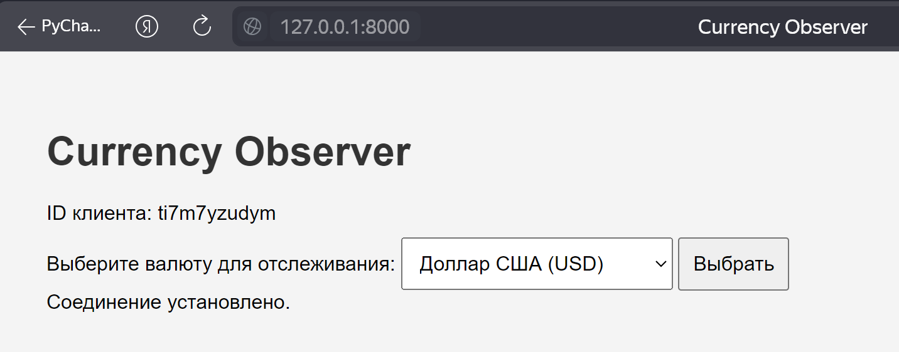
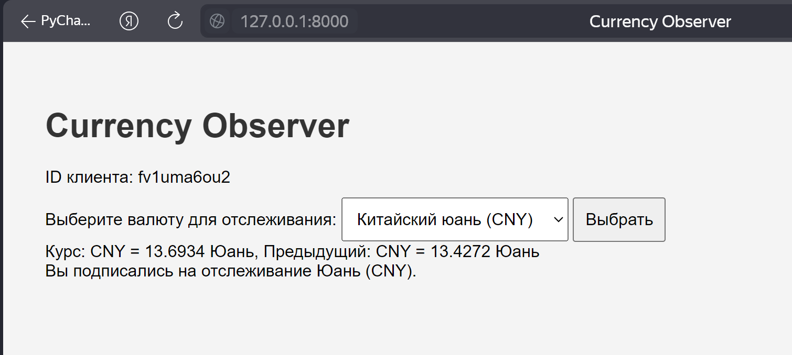

# Кочеткова Мария Павловна ИВТ-2.2. 
## Лабораторная работа 7. Использование шаблона «Наблюдатель»
___

Необходимо создать программу на языке Python, которая использует паттерн проектирования "Наблюдатель" для отслеживания изменений курсов валют через API Центробанка РФ. Программа должна запрашивать курсы валют и уведомлять зарегистрированных наблюдателей о изменении курсов в реальном времени или через заданные интервалы времени.
Структура реализованного задания должна представлять

* Объект — веб-сервер FastAPI.
* Наблюдатели - клиенты, представляющие HTML-страницы, связывающиеся с объектом с помощью веб-сокетов. На странице 
должен отображаться идентификатор клиента.

[Код приложения](https://github.com/Maria-Kochetkova/LR_Prog_5_sem/tree/main/lr7/main.py)  
[Код интерфейса](https://github.com/Maria-Kochetkova/LR_Prog_5_sem/tree/main/lr7/cont.py)

Запуск сервера:  

Результат при запуске:  

Результат при выборе валюты:  
